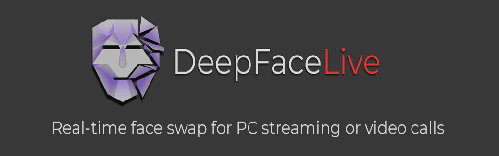

## Stacoverflow : @Elviana16x
- Program ini dibuat untuk pembelajaran dari perkembangan teknologi saat ini.

- Gunakan program ini dengan bijak.

- Jangan menggunakannya untuk melakukan tindak kejahatan yang dapat merugikan orang lain.

<table align="center" border="0">

<tr><td colspan=2 align="center">

Kamu dapat menukar wajahmu dari webcam atau wajah dalam video menggunakan foto orang lain.

</img>

</td></tr>

</table>
<table align="center" border="0">

<tr><td colspan=2 align="center">

## Face Swap (DFM)

Kamu dapat menukar wajahmu dari webcam atau wajah di video menggunakan model wajah terlatih.

Berikut daftar model wajah siap pakai yang tersedia.

Saya dan teman-teman saya mencoba untuk mengembangakan teknologi yang ada saat ini.
</td></tr>

<tr><td colspan=2 align="center">

<table align="center" border="0">
<tr><td align="center">
    
Keanu Reeves

</img>

<a href="doc/celebs/Keanu_Reeves/examples.md">examples</a>
</td><td align="center">
    
Irina Arty

</img>

<a href="doc/celebs/Irina_Arty/Irina_Arty/examples.md">examples</a>
</td><td align="center">
    
Rob Doe

</img>

<a href="doc/celebs/Rob_Doe/Rob_Doe/examples.md">examples</a>
</td><td align="center">
    
Natasha Former

</img>

<a href="doc/celebs/Natasha_Former/examples.md">examples</a>
    
</td></tr>

</table>

<table align="center" border="0">
<tr><td align="center">
    
Dilraba Dilmurat

</img>

<a href="doc/celebs/Natalie_Fatman/examples.md">examples</a>
</td><td align="center">
    
Liu Lice

</img>

<a href="doc/celebs/Liu_Lice/examples.md">examples</a>
</td><td align="center">

Meggie Merkel

</img>

<a href="doc/celebs/Meggie_Merkel/examples.md">examples</a>
</td><td align="center">
    
Tina Shift

</img>

<a href="doc/celebs/Tina_Shift/examples.md">examples</a>
</td></tr></table>

</td></tr>

<tr><td colspan=2 align="center">
Jika kamu menginginkan kualitas yang lebih tinggi atau kecocokan wajah yang lebih baik, kamu dapat melatih model wajahmu sendiri menggunakan 'DeepFaceLab' yang dilatih pada wajah tertentu dan digunakan dalam panggilan video.

</td></tr>

</table>

<table align="center" border="0">

<tr><td colspan=2 align="center">

## Face Animator

Ada juga modul 'Face Animator' di aplikasi 'DeepFaceLive'. kamu dapat mengontrol gambar wajah statis menggunakan video atau wajahmu sendiri dari kamera. Kualitasnya bukan yang terbaik dan memerlukan parameter pencocokan dan penyetelan wajah yang bagus untuk setiap pasangan wajah, tetapi cukup untuk video lucu dan meme atau streaming real-time pada 25 fps menggunakan GPU 35 TFLOPS.

</img>

</td></tr>

</table>

<table align="center" border="0">

<tr><td colspan=2 align="center">

## System requirements

Kartu grafis apa pun yang kompatibel dengan DirectX12

(Direkomendasikan RTX 2070+ / Radeon RX 5700 XT+ )

CPU modern dengan instruksi AVX

RAM 4GB, file paging 32GB+

Windows 10

</td></tr>
<tr><td colspan=2 align="center">

## Documentation

</td></tr>
<tr><td align="right">
Windows
</td><td align="left">

<a href="doc/windows/main_setup.md">Main setup</a>

- <a href="doc/windows/for_streaming.md">additional setup for streaming</a>

- <a href="doc/windows/for_video_calls.md">additional setup for video calls</a>       

<a href="doc/windows/using_android_phone_camera.md">Using Android phone camera</a>  

</td></tr>
<tr><td align="right">
Linux
</td><td align="left">
<a href="build/linux">Build info</a>
</td></tr>
<tr><td align="right">
Frequently asked questions
</td><td align="left">
<a href="doc/user_faq/user_faq.md">for User</a>

<a href="doc/developer_faq/developer_faq.md">for Developer</a>
</td></tr>
<tr><td colspan=2 align="center">

## Releases

</td></tr>
<tr><td align="right">

<a href="https://disk.yandex.ru/d/7i5XTKIKVg5UUg">Windows 10 x64 (yandex.ru)</a>

<a href="https://mega.nz/folder/m10iELBK#Y0H6BflF9C4k_clYofC7yA">Windows 10 x64 (mega.nz)</a>

</td><td align="left">
Berisi folder self-extracting portabel all-in-one yang berdiri sendiri dan siap digunakan! Kamu tidak perlu menginstal apa pun selain driver video.
  
DirectX12 dibuat : NVIDIA, AMD, Intel videocards.
  
NVIDIA dibuat : Khusus kartu NVIDIA, GT730 dan lebih tinggi. Bekerja lebih cepat dari DX12. FaceMerger juga dapat bekerja pada AMD/Intel.
</td></tr>

<!--<tr><td colspan=2 align="center">
<a href="https://www.paypal.com/paypalme/DeepFaceLab">Donate via Paypal</a>
</td></tr>-->

<!--
    <a href="https://br-stone.online"></img></a><a href="https://exmo.com"></img></a>

    presents

    <tr><td align="right">

    <a href="">Windows (magnet link)</a>
    </td><td align="center">Latest release. Use torrent client to download.</td></tr>
    </tr>
-->

</table>

